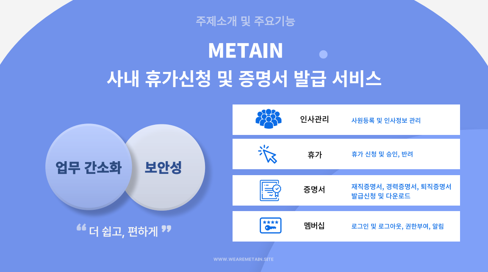
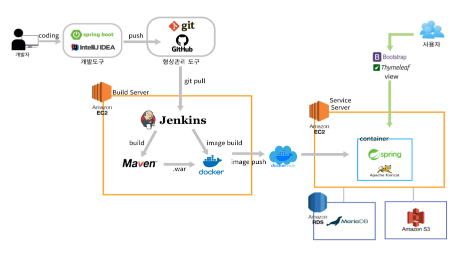
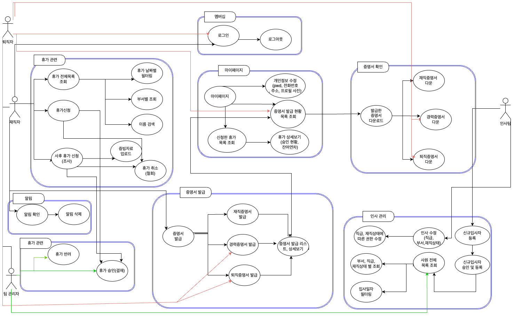
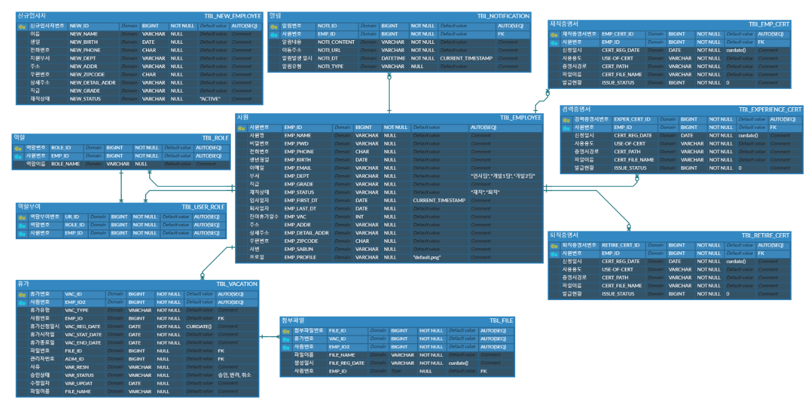
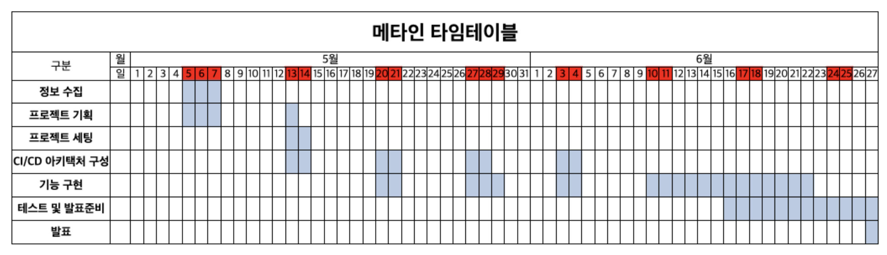

# METAIN (메타人)

 

## 1. 프로젝트 소개
* 인사 관리를 포함한 사내 휴가 관리 및 증명서 발급 서비스 

 

## 2. 주요기능
* 휴가 신청 및 승인, 반려
* 증명서 발급 및 다운로드
* 인사 정보 관리 및 사원 관리
* 알림

## 3. 개발환경
|구분|내용|
|------|---|
|사용언어|Java, HTML, CSS, JavaScript|
|개발도구|Spring boot /  Intellij Ultimate / etc...|
|빌드도구|Maven|
|CI/CD 도구|Jenkins|
|서버환경|서버 환경: [가상 서버: EC2, 운영 체제: Ubuntu]   프로젝트 구동 서버: [웹 애플리케이션 서버 - Tomcat 9.0]
|데이터베이스| MariaDB / etc..|
|사용한 라이브러리| Bootstrap /  jQuery / MyBatis / Lombok / Tymeleaf etc...|

## 4. 아키텍처(구조)

 

## 5. 기능 흐름도
### 서비스 흐름도(유스케이스)
#### SW 유스케이스

 

#### ER 다이어그램

 

## 6 SW 동작 화면

### 메인페이지

### 캠모드

### 카테고리모드

## 7 제작 일정

 

## 8 팀원 소개
|              Infra, Backend              |                    PL, Backend                     |                Infra, Backend                 |
|:-------------------------------------------:|:----------------------------------------------:|:---------------------------------------------:|
|  |                <!-- 규 사진 -->           |  |
|     [김수현](https://github.com/suhyunking)      |      [정규연](https://github.com/kyucando)       |      [한서영](https://github.com/seoyyy)       |

## 9 트러블슈팅

### 항목
* 내용
